If you're reading this, chances are you're either curious about the next big thing in cloud computing or you're actively seeking ways to enhance your development workflow. As the creator of Taubyte, I'm here to share a journey into the future of cloud computing—a future we're building to be as intuitive as software development itself. This isn't just another tool; it's a paradigm shift designed with you, the developer, at heart.

Taubyte simplifies the process of building a cloud computing platform, making it a no-brainer. Unlike other products, such as Kubernetes, which were not designed with software developers in mind nor as platforms, Taubyte eliminates the need for DevOps and platform engineering. In essence, Taubyte is designed for software developers, requiring no DevOps nor platform engineering skills. To achieve this, we aimed not just for automation but for autonomy.

If you're a DevOps professional reading this, you might think it sounds too good to be true, or perhaps you're inclined to deny its feasibility, fearing it will make your job obsolete. However, I invite you to stay with us because Taubyte is as real as it is open source. Moreover, I believe it will give DevOps and Platform Engineers an unprecedented advantage.

## Let's get our hands dirty!

The best way to learn something is by doing it, and that's exactly what we're going to do. All you need is `npm`. While there are other methods, we'll stick to `npm` as it's the simplest and most widely available, even on Windows.

What we'll do is install `dreamland`, a project hosted on [github.com/taubyte/dreamland](https://github.com/taubyte/dreamland) that allows you to run a Taubyte-based Cloud Computing Platform locally. It's an excellent tool for local development and testing, but we'll use it in a slightly different way.

Run the following command to install dreamland:

```sh
$ npm i @taubyte/dream
```

Now, you should have the `dream` command-line tool available. Let's start a cloud:

```sh
$ dream new multiverse
[INFO] Dreamland ready
[SUCCESS] Universe blackhole started!
```

> You can ignore any ERROR messages you might see about `seer`.

Once you see `SUCCESS`, it means your cloud has been fully started.

## A first look

First, let's explore what's happening using the command line. Run:

```sh
$ dream status universe
```

This should output something like:

```
┌───────┬─────────────────────┬────────┬───────┐
│ Nodes │ elder@blackhole     │ p2p    │ 14051 │
│       ├─────────────────────┼────────┼───────┤
│       │ tns@blackhole       │ http   │ 14466 │
...
```

This lists all the running nodes. Each node could be running a specific protocol (e.g., tns or substrate) and will reflect that. Others will have a role like elder (bootstrap node) or client.

Also, `@blackhole` indicates that the node is part of the blackhole universe. Each universe represents a cloud and is cryptographically isolated from any other cloud on the peer-to-peer layer.

On the right side, you can see the TCP ports each node is using along with the number of copies.

Now, let's leave the terminal and head to [console.taubyte.com](https://console.taubyte.com) where you're going to locate the Dreamland button. Then click on it.


> The button will be disabled or hidden if dreamland is not detected.

Now, locate the sidebar: (1) click on Network, then (2) on blackhole.
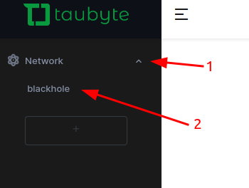

After a few seconds, you should see something similar to:


On the network graph, which you can manipulate, you can see all the same nodes as before from the CLI.

If you hover over any node, it'll display the TCP ports it's using.


## What's with the mesh network?

Hosts, or as we call them, Nodes, form a Taubyte-based Cloud Computing Platform and communicate with each other using a peer-to-peer network. Running locally through dreamland, all the nodes are interconnected, although this might not always be the case in production, especially if you have many nodes.

The peer-to-peer nature of Taubyte-based clouds gives them important characteristics like resilience and redundancy.

## Protocols

While in production a node can run multiple protocols by defining a shape (a term reminiscent of the internal name `tau` had: `odo`, a reference to the shape-shifting Star Trek character), in dreamland, each node runs only one protocol. This design choice simplifies protocol debugging.

Without further ado, here's what each protocol does:

* `auth` handles token validation and secret management.
* `tns` ensures project registry consistency across the cloud.
* `seer` is responsible for DNS resolution and load balancing.
* `patrick` bridges git events into CI/CD jobs.
* `monkey` executes CI/CD jobs.
* `hoarder` manages replication.
* `substrate` handles request processing and serving.
* `gateway` manages L7 load-balancing.

## The other nodes

The other nodes, referred to as Simples (admittedly, not the best name), include `elder` and `client`. While they are not crucial for the purpose of this article and could be excluded when starting the universe, it's helpful to understand their intended roles:

* `elder` nodes are used for bootstrapping. Since `dreamland` interconnects all nodes, an `elder` is included for testing purposes when using [libdream](https://github.com/taubyte/tau/tree/main/libdream).
* `client` nodes are lightweight and can be used to test protocols or peer-to-peer services deployed on the cloud.

Note: Some `fixtures`, which will be covered in another article, may require Simples to function correctly.

## Creating a project

Now, let's create a project on this cloud. Although it can be done using [tau-cli](https://github.com/taubyte/tau-cli), which you might prefer if you're a terminal enthusiast like me, we're going to use the [Web Console](https://console.taubyte.com) instead.

Open a new browser window or tab and navigate to [console.taubyte.com](https://console.taubyte.com).

(1) Type your email, then (2) click on the network selection input, and finally (3) click on `Dreamland/blackhole`.
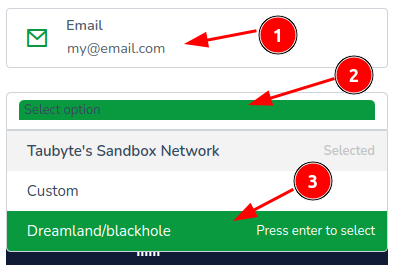

Next, click the `Login with GitHub` button.


You will be asked to grant the app GitHub access. This access is local to your browser and is used to create repositories related to your project, which will be cloned into a browser-based virtual file system.

The next screen will display "Your projects" and should show no projects. You'll want to click on `Create project`.


Enter a project name, a description, toggle private (unless you want the project repositories to be public), then click on `Create Project`.


The Web Console will create two repositories: one for configuration, containing mainly YAML files, and another for inline code, containing code in different languages to be compiled to WebAssembly. If everything goes well, you'll be directed to the dashboard.


## Creating a Function

Taubyte-based Clouds support serverless functions. Let's create one!

Click on `Functions` in the side menu, then on the `+` button.


To expedite the process, we'll use a template. Skip filling any field for now and click on the `Template Select` button.
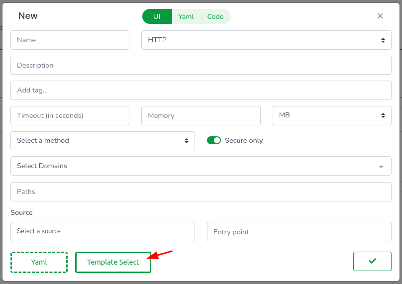

This action opens another modal at the top where you can select a template. Although you can choose Go, Rust, or AssemblyScript at the time of writing this article, we'll keep it simple and go for Go! (pun intended). So: (1) select Go, (2) select `ping_pong`, and finally (3) close the modal.


All fields have been automatically filled except for the domains. Proceed by (1) clicking on the list and (2) selecting GeneratedDomain. This action will create a domain resource for you.


It's worth noting that the Web Console clones your repositories in-browser, meaning there's always a code equivalent to everything you do. Let's review the YAML config by clicking on the `Yaml` tab.
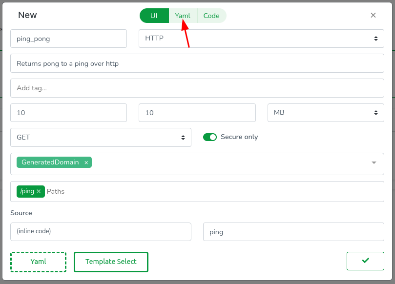

You will see YAML code resembling the following:

```yaml
id: ''
description: Returns pong to a ping over HTTP
tags: []
source: .
trigger:
  type: https
  method: GET
  paths:
    - /ping
domains:
  - GeneratedDomain
execution:
  timeout: 10s
  memory: 10MB
  call: ping
```

Most of this YAML should be self-explanatory, but let me clarify a few points:

* `source`: can either be `.` for inline code or the name of a library (to be explored in other articles).
* `execution.call`: specifies the function to be executed and must be exported by the WebAssembly module.

Next, let's inspect the code. The Web Console features a modest code editor useful for quick inline code updates. Access it by clicking on the `Code` tab.


In the editor, you will observe (1) the usual Go files including go.mod, (2) the code for our handler function `ping`, and (3) a `.taubyte` folder defining how the function is built.


While understanding the entire code or mastering Go isn't necessary, I'll explain a few basic concepts that will map in a way or another to any serverless function in supported languages:

* The package name can be anything except `main`. The building container, `taubyte/go-wasi` on Docker Hub, wraps your function in a special `main` function.
* The `github.com/taubyte/go-sdk` package simplifies interactions with the Taubyte VM, making it straightforward to use VM primitives.
* We use `tinygo` to compile Go into small, efficient WebAssembly modules. To export a function, annotate it with the `//export` comment.
* Taubyte supports various trigger types, so handlers receive an event. We care about efficiency, so `event.Event` is  really a wrapper of a `uint32`, minimizing unnecessary memory allocation and copying.

Click `Done` to proceed.
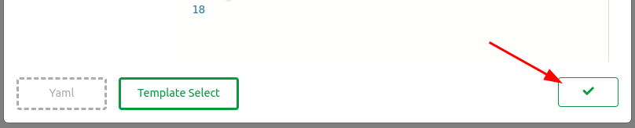

The function should now appear listed.


Everything done so far is confined to the virtual filesystem in your browser. To apply these changes, we need to push them. Find the green button at the bottom right of the screen and click on it.


A modal will guide you through the code changes, starting with configuration changes. Click on the domains folder, then open the GeneratedDomain.yaml file.
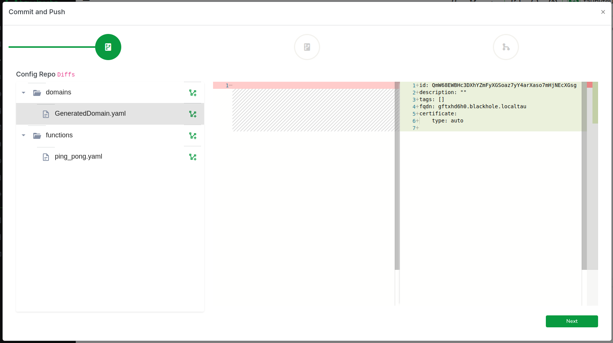

Copy the FQDN generated for you as we will need it later:

```yaml
fqdn: gftxhd6h0.blackhole.localtau
```

Click on Next to review code changes.


One more click on Next takes you to the final step, where you'll (1) enter a commit message and (2) push the changes to GitHub.
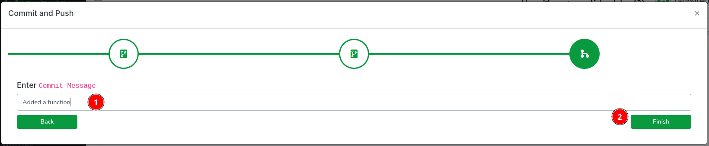

In production, this push would trigger an event captured by `patrick`. However, because we're using `dreamland` and GitHub cannot reach your nodes directly, we run a fixture called `push-all` to emulate the git events. Switch back to your terminal and run:

```sh
$ dream inject push-all
```

Return to the Web Console and, on the side menu, click on `Builds`. You should see two CI/CD jobs, one for configuration and one for code.


After a few seconds, the build should complete. Click on `Refresh` if it seems delayed. Then, click on the stack icon to view the ping\_pong function.
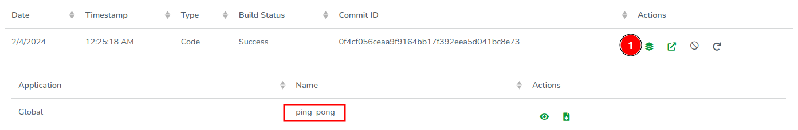

## Executing the Function

Now that our function has been built and its configuration published on `tns`, we can execute it by hitting the endpoint. Since we're running a local cloud, we need to find out which port the `substrate` (or `gateway`, if you're using one) node uses to handle HTTP requests. To do this, run:

```sh
$ dream status substrate
```

In my case, the HTTP port is 14529.

```
┌─────────────────────┬────────┬───────┐
│ substrate@blackhole │ copies │     1 │
│                     ├────────┼───────┤
│                     │ dns    │ 14304 │
│                     ├────────┼───────┤
│                     │ http   │ 14529 │
│                     ├────────┼───────┤
│                     │ p2p    │ 14282 │
└─────────────────────┴────────┴───────┘
```

You can test the function using `curl` as follows, making sure to replace `gftxhd6h0.blackhole.localtau` with your own generated domain:

```sh
$ curl -H "Host: gftxhd6h0.blackhole.localtau" http://127.0.0.1:14529/ping
```

Output:

```
PONG
```

Alternatively, you can add the generated domain to your local hosts file (`/etc/hosts` in my case) as follows:

```sh
$ sudo vi /etc/hosts
127.0.0.1 gftxhd6h0.blackhole.localtau
```

Save and exit, then run `curl` again but without the `Host` header:

```sh
$ curl http://gftxhd6h0.blackhole.localtau:14529/ping
```

Output:

```
PONG
```

If you've added the generated domain to your `/etc/hosts`, you can also use the Web Console to hit the function's endpoint: (1) In the sidebar, click on `Functions`, then (2) click on the thunder icon.


This action opens a new tab where you should see something like this:


Congratulations! You've successfully created a cloud and executed a serverless function on it!

## What Just Happened!

In this section, we'll take a step back to review the processes and protocols involved in each step of deploying and executing a serverless function with Taubyte. This overview will help clarify the interactions between different components and the significance of each protocol in the overall architecture.

### Project Creation

The creation of a project is predominantly a client-side operation, facilitated by either the Web Console or the tau-cli. This process involves direct communication with GitHub to establish the necessary repositories. Only towards the end does the `auth` protocol come into play, tasked with registering these repositories. This registration process includes storing critical secrets such as the deployment key, essential for cloning code during CI/CD processes, and the webhook secret, used to authenticate events coming from GitHub.

The sequence diagram below illustrates these interactions in detail:

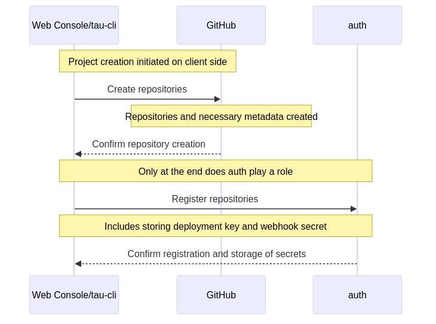

### Pushing Changes to GitHub

When changes are pushed to GitHub, a sequence of events is triggered, initiating a process that involves multiple protocols to manage and execute CI/CD jobs. The `patrick` protocol plays a pivotal role in verifying the legitimacy of events and creating jobs, while the `monkey` protocol is responsible for the execution of these jobs. Subsequently, the `tns` stores and replicates the compiled configuration, and the `hoarder` protocol ensures the replication of updated assets.

The sequence diagram below visualizes this workflow:

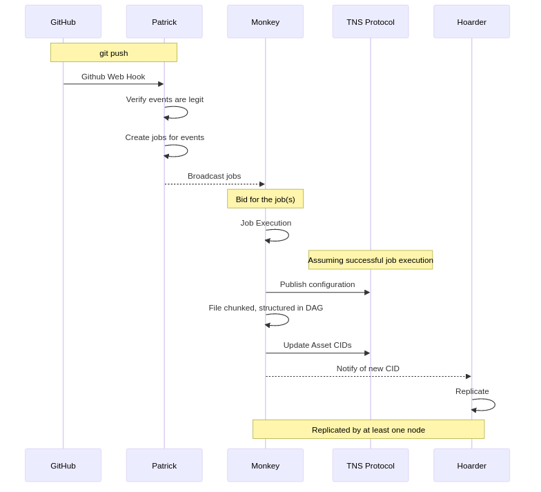

It's important to note that because we are using Dreamland, a simulated environment, there's no direct way for GitHub to communicate with your nodes. This limitation is addressed by using the fixture called `push-all`, which emulates the git events that would typically trigger the CI/CD process in a production environment.

### Hitting the Endpoint

The process for handling a request at an endpoint varies depending on the network's configuration. In a simple setup without gateways and HTTPS, the request's host name is resolved by the `seer` protocol before the request itself is processed by a `substrate` node. However, in networks with gateways or HTTPS requests, additional steps, like retreiving x509 certificate from `auth`, are involved.

The diagrams below detail these processes for different configurations:

* Without Gateway and HTTPS:

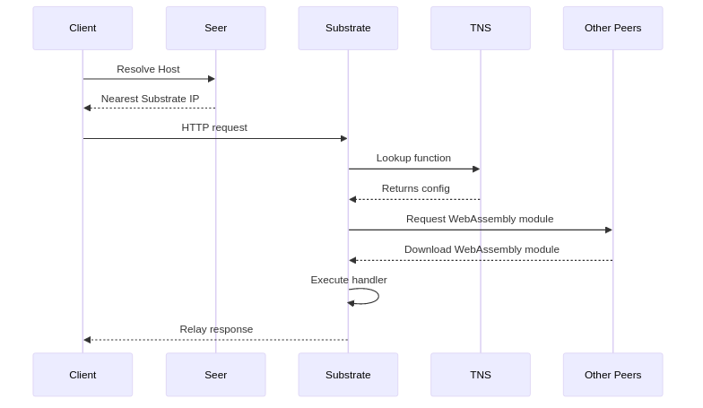

* With Gateway:

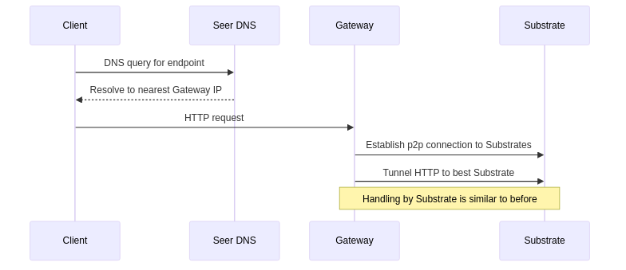

* With HTTPS:

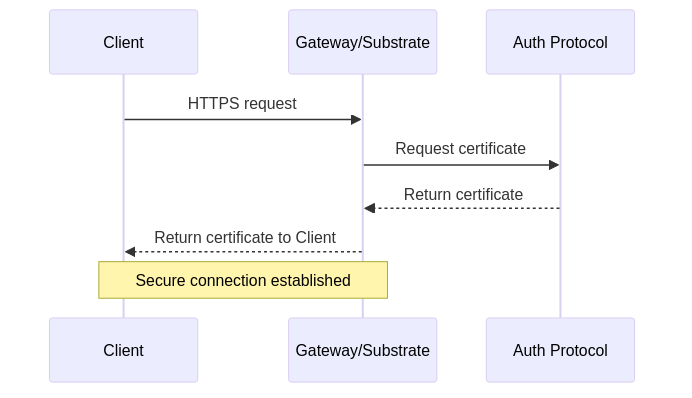

> Note: Taubyte supports the Automatic Certificate Management Environment (ACME) protocol for auto-generating certificates using Let’s Encrypt.

These diagrams demonstrate the seamless and autonomous nature of the Taubyte platform, which requires no manual configuration and ensures a smooth deployment and execution process for serverless functions.

## A Glimpse into the Future

This article is but a gateway into the vast potential that Taubyte unlocks. Through a hands-on demonstration of setting up a cloud environment and deploying serverless functions, I hope to have given you a taste of the simplicity and efficiency Taubyte brings to cloud computing.

Our mission with Taubyte is to democratize cloud development, making it as natural and creative as the development process itself. Whether you're venturing into the cloud for the first time or you're a seasoned developer seeking to streamline your processes, Taubyte is designed to empower your innovation.

As we embark on this journey together, I invite you to explore, to experiment, and to contribute. With Taubyte, the future of cloud computing is not just about technology; it's about the community and creativity it fosters. Welcome to a new era of cloud computing, where the skies are not the limit—they're just the beginning.


